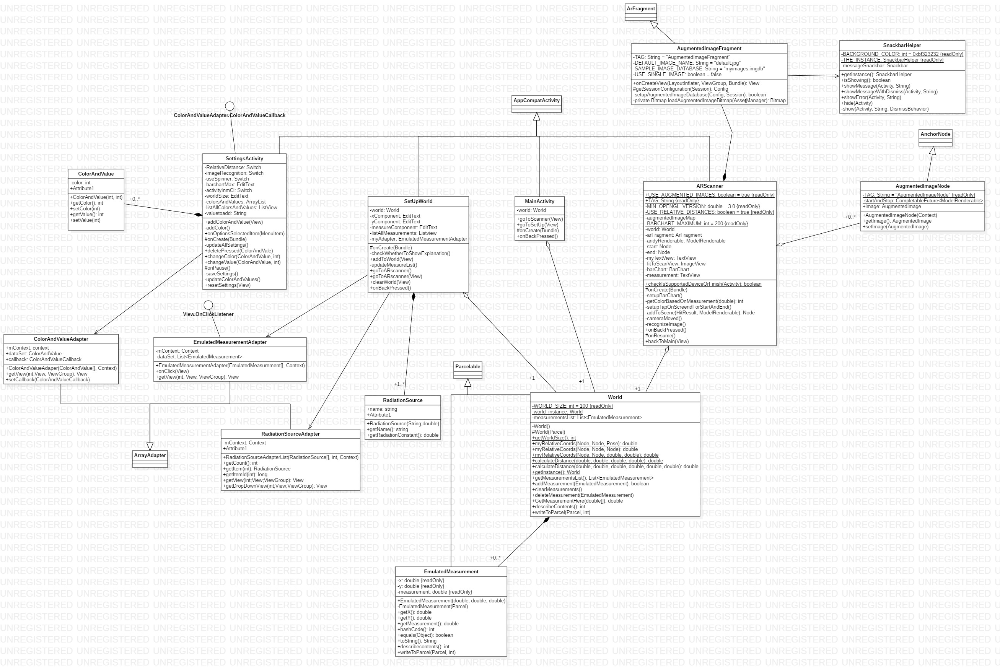

Radiation Emulator
========
## How to start developing the app further on a real device 
Make sure the the device supports ARCore, [devices](https://developers.google.com/ar/discover/#supported_devices) that support it, install [ARCore](https://play.google.com/store/apps/details?id=com.google.ar.core&hl=en) and make sure the phone has USB debugging enabled, [how to](https://www.embarcadero.com/starthere/xe5/mobdevsetup/android/en/enabling_usb_debugging_on_an_android_device.html).

Now just open the project in Android Studio, click run and select your device.

## Language: Java vs Kotlin

For now the application is written in Java, although google sponsors Kotlin and Kotlin has some interesting features. I have chosen Java because I am more familiar with it and I started building on an example that was made in Java. There should be no difference in performance since both Kotlin and Java compile to Bytecode. Which means it is possible to use Kotlin when adding new classes without any problems. Possibly I will rewrite it to Kotlin because Kotlin is more concise and a bit more readable, and also because it would be a great learning experience.

## UML class diagram

## How to change the rendered 3D model
Make sure you have the `google sceneform tools` plugin installed, how to add the plugin to Android Studio can be found [here](https://developers.google.com/ar/develop/java/sceneform/#import-sceneform-plugin).

Find a new 3D model you would like, make sure it has the right extension `OBJ, FBX, glTF` files can be used. Place your new model in `/app/sampledata/models/`, right click on your model in Android Studio and click on `Import Sceneform Asset`, this will convert is to an object that can be rendered by sceneform.

Now to make the application use it, go to `ARScanner.class` here you will find ` public static final String MODEL_3D = "21386_Exclamation_Point_v1.sfb";` change it to your newly generated sceneform model and now it will use the new model.

## Outlining the area

There are 3 possibilities
1. Manually selecting 2 points on the screen
2. Image recognition
3. Cloud anchors

#### Manually selecting 2 points on the screen
For now this is how it is done, mainly because it is the easiest way that can be tested in the android emulator.

Cons:
* Each device has to manually define the start and end, different devices will have different measurements
* Inaccurate  

Pros:
* Easy to implement
* Can be tested on an emulator

#### Image recognition
Has also been implemented. Works pretty good, but sometimes images start jumping around.

Cons:
* Needs printouts of the images that have to be recognized

Pros:
* Easy to implement
* Multiple devices can have the same start and end points, resulting in comparable measurements
* More accurate

##### Change the images for start and stop

To change the images navigate to `/app/src/main/assets/` make sure you have the [arcoreimg](https://github.com/google-ar/arcore-android-sdk/tree/master/tools/arcoreimg/windows) installed. Replace `start.jpg` and `stop.jpg`with the new images. Then run `arcoreimg.exe build-db --input_image_list_path=myimages.imgdb-imglist.txt --output_db_path=myimages.imgdb`, now the application will use the newly provided images.

#### Cloud anchors
Stores to start and end points on googles servers for 24 hours, more info [here](https://developers.google.com/ar/develop/java/cloud-anchors/overview-android). This would be nice to implement next to one of the above so the application is also usable without an internet connection.

Cons:
* Needs to be setup by another device
* Takes around 10 sec to save and to recognize points
* Difficult to implement
* Saved for only 24 hours
* Requires an active internet connection

Pros:
* Multiple devices can have the same start and end points, resulting in comparable measurements
* No need for extra materials like print outs
* More accurate (?)

## Models

### EmulatedMeasurement

This class is used to store a measurement on a 2D coordinate, 2D because height feels like it's a bit irrelevant and would just add more inaccuracy. Made into a class instead of an array[3] because it makes it more expendable.

### World

This class stores a list of all the EmulatedMeasurements and a static field for the virtual world size. It also provides methods to get the distance between points in the world, to translate the real world coordinates to the coordinates in the virtual world and a method to calculate the measurement on a certain point.

### RadiationSource

This is a simple class that can store the name of a source and the exposure rate constant. It is used to show sources by name in the SetUpWorld screen in a drop-down menu.

### ColorAndValue

Another simple class that stores 2 integers one representing a color the other a value. This is used to determine the color of the chart in ARscanner, if the measurement is lower than the value of `ColorAndValue.getValue` the chart will get the color of `ColorAndValue.getColor`.

### Constants

Final class containing mostly string constants used get settings from `SharedPreferences`, but also a couple of other constants used throughout the application.

## Build warning

When building we get the following warning: "WARNING: API 'variant.getMergeAssets()' is obsolete and has been replaced with 'variant.getMergeAssetsProvider()'. It will be removed at the end of 2019." This is a sceneform bug that is in the hands of those developpers. They have acknowledged the problem and should fix it some time in the future, [github reference](https://github.com/google-ar/sceneform-android-sdk/issues/513).

## Distributing the application

1. Google play: requires google developer account -> 25$ below some interesting links if you want to go this route  
a. [Sign your app](https://developer.android.com/studio/publish/app-signing)  
b. [Let google do the signing](https://developer.android.com/guide/app-bundle/)  
c. [Upload to the playstore](https://support.google.com/googleplay/android-developer/answer/113469?hl=en)
2. Give .apk file to users (need to enable install from unknown devices on phones that want to run the app). Follow [this link](https://stackoverflow.com/questions/16709848/build-unsigned-apk-file-with-android-studio) to learn how you should build your .apk file.
